# 🌾 SmartAgricultureLifeCycle – AI-Powered Crop Planning & Post-Harvest Decision Support System

<p align="center">
  
</p>

<p align="center">


</p>

---

# 📖 Overview

**SmartAgricultureLifeCycle** is an AI-powered agricultural decision support platform that assists farmers throughout the complete farming lifecycle—from crop selection and cultivation planning to harvest quality assessment and post-harvest decision making.

The platform integrates **Machine Learning**, **Expert Validation**, and **Market Intelligence** to provide intelligent recommendations that improve productivity, maximize crop quality, and increase farmers' profitability.

---

# ✨ Highlights

- 🌱 AI-Based Crop Recommendation
- 🌾 Crop Quality Assessment
- 📈 Market Trend Analysis
- 📦 Post-Harvest Decision Support
- 👨‍🔬 Expert Validation
- 📊 Interactive Dashboard
- 🌍 End-to-End Agriculture Lifecycle Management

---

# 🎯 Objectives

- Recommend suitable crops using soil and environmental parameters.
- Improve farming decisions using Machine Learning.
- Assess harvested crop quality.
- Analyze market trends for better selling decisions.
- Provide intelligent post-harvest recommendations.
- Combine AI predictions with agricultural expert knowledge.

---

# 🌾 System Modules

## 🌱 Pre-Harvest Module

- Farmer Registration & Login
- Soil Data Collection
- Environmental Data Analysis
- Crop Recommendation
- Expert Validation
- Crop Planning

---

## 🌾 Harvest Module

- Harvest Details Submission
- Crop Quality Assessment
- Moisture Analysis
- Damage Analysis
- Grade Prediction (A/B/C)
- Expert Validation

---

## 📈 Market Intelligence Module

- Historical Price Analysis
- Market Trend Visualization
- Future Price Prediction
- Demand Analysis

---

## 📦 Post-Harvest Decision Module

Based on crop quality and market trends, the platform recommends:

- ✅ Sell Immediately
- 📦 Store
- 🏭 Process

All recommendations are validated by agricultural experts.

---

# 🏗️ System Architecture

The SmartAgricultureLifeCycle platform integrates a modern web application with Machine Learning models and expert validation to support farmers throughout the agricultural lifecycle.

## 🌐 Overall System Pipeline

<p align="center">

</p>

<p align="center">
<b>Figure 1.</b> Overall workflow of SmartAgricultureLifeCycle illustrating farmer interaction, backend services, AI modules, expert validation, and final recommendations.
</p>

---

## 🤖 Machine Learning & Data Layer

<p align="center">

</p>

<p align="center">
<b>Figure 2.</b> Machine Learning and data processing pipeline showing dataset ingestion, preprocessing, Random Forest crop prediction, market analysis, and database interactions.
</p>

---

# 🔄 Workflow

```text
Farmer Login
      │
      ▼
Enter Soil Information
      │
      ▼
Crop Recommendation
(Random Forest)
      │
      ▼
Expert Validation
      │
      ▼
Crop Planning
      │
      ▼
Harvest Details
      │
      ▼
Quality Assessment
      │
      ▼
Expert Validation
      │
      ▼
Market Trend Analysis
      │
      ▼
Post-Harvest Decision
      │
      ▼
Expert Validation
      │
      ▼
Final Recommendation
```

---

# 🤖 Machine Learning

## Crop Recommendation

### Algorithm

🌳 **Random Forest Classifier**

### Input Features

- Nitrogen (N)
- Phosphorus (P)
- Potassium (K)
- Temperature
- Humidity
- pH
- Rainfall

### Output

- Recommended Crop

---

## Market Intelligence

The platform analyzes:

- Historical Price Trends
- Future Market Prices
- Market Demand

using:

- Regression Models
- Rule-Based Decision Logic

---

# 👨‍🔬 Expert Validation

One of the key features of the platform is **Expert-in-the-Loop Decision Support**.

Agricultural experts can:

- Review AI predictions
- Modify recommendations
- Approve final outputs
- Provide personalized farming advice

Displayed to farmers as:

- ✅ Verified by Expert
- 📌 Expert Notes
- 💬 Expert Recommendation

---

# 📊 Dashboard & Reports

The platform provides:

- Crop Recommendation Dashboard
- Crop Quality Assessment
- Market Trend Graphs
- Expert Recommendations
- Downloadable Reports

---

# 🛠️ Technology Stack

## Frontend

- React.js
- HTML5
- CSS3
- JavaScript
- Bootstrap

---

## Backend

- Node.js
- Express.js

---

## Machine Learning

- Python
- Scikit-Learn
- Pandas
- NumPy
- Random Forest

---

## Database

- MongoDB

---

# 📂 Datasets

## 🌱 Crop Recommendation Dataset

### Features

- Nitrogen
- Phosphorus
- Potassium
- Temperature
- Humidity
- pH
- Rainfall

### Target

- Recommended Crop

---

## 📈 Market Dataset

### Features

- Crop Name
- Market
- Location
- Date
- Price

---

# 🔗 API Endpoints

## Authentication

```http
POST /login
POST /register
```

---

## Crop Recommendation

```http
POST /predict-crop
```

---

## Harvest

```http
POST /submit-harvest
```

---

## Market Intelligence

```http
GET /market-trend
```

---

## Post-Harvest

```http
POST /post-harvest-decision
```

---

## Expert Validation

```http
GET /expert/recommendations

POST /expert/approve-crop

POST /expert/validate-quality

POST /expert/post-harvest-review
```

---

# ⭐ Key Features

- 🌱 AI-Powered Crop Recommendation
- 🌾 Intelligent Crop Quality Assessment
- 📈 Market Trend Prediction
- 📦 Post-Harvest Decision Support
- 👨‍🔬 Expert Validation
- 📊 Interactive Dashboard
- 📑 Downloadable Reports
- 🌍 End-to-End Smart Agriculture Lifecycle Management

---

# 📂 Repository Structure

```text
SmartAgricultureLifeCycle
│
├── 📁 frontend/
├── 📁 backend/
├── 📓 Agrilifecycle.ipynb
├── 📓 model.ipynb
├── 📊 Crop_recommendation.csv
├── 📊 final_dataset.csv
├── 🖼️ smart_agriculture_main_pipeline.svg
├── 🖼️ smart_agriculture_data_ml_layer.svg
├── 📄 package.json
├── 📄 package-lock.json
├── 📄 .gitignore
└── 📄 README.md
```

---

# 🚀 Installation

Clone the repository

```bash
git clone https://github.com/yourusername/SmartAgricultureLifeCycle.git

cd SmartAgricultureLifeCycle
```

Install project dependencies

```bash
npm install
```

Run the backend server

```bash
npm start
```

Open the Machine Learning notebooks

- `Agrilifecycle.ipynb`
- `model.ipynb`

using **Jupyter Notebook** or **Google Colab**.

---

# 🚀 Future Enhancements

- 📷 AI-based Crop Disease Detection
- 🌦 Weather API Integration
- 📱 Android & iOS Mobile Application
- ☁ Cloud Deployment (AWS / Azure)
- 🤖 Deep Learning-Based Crop Recommendation
- 🌍 Multi-Language Support
- 🛰 Satellite-Based Crop Monitoring
- 🌡 IoT Sensor Integration
- 📊 Real-Time Farmer Analytics Dashboard


---

<p align="center">

⭐ **If you found SmartAgricultureLifeCycle useful, please consider giving this repository a Star!**

Made with ❤️ for Smart Agriculture and AI-Powered Farming.

</p>
